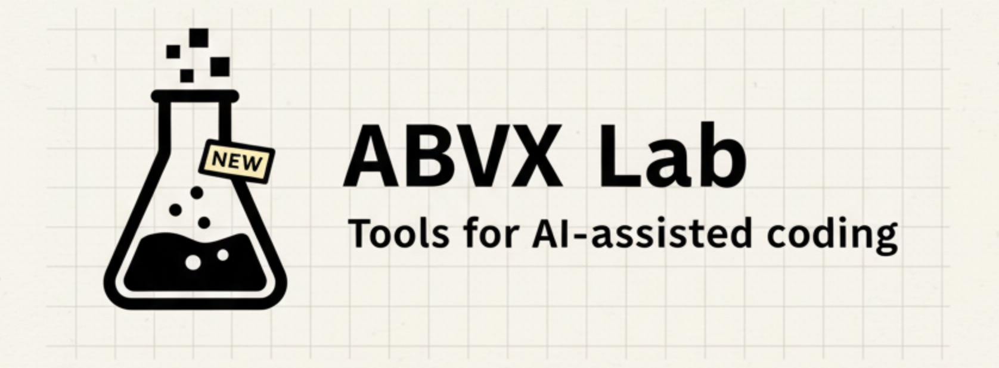

# ABVX Lab

A static hub and read-only control plane for ABVX developer tools.
The live site now uses the `alt-b` production shell: `SET` is the orchestration entrypoint, `ID` is the portable profile-and-hook layer, `LWP` is the lightweight desktop execution protocol, the home page opens with a tracked-repos snapshot plus a quieter supporting-tools directory, and tool pages share the same product-sheet layout.

Live: [lab.abvx.xyz](https://lab.abvx.xyz/)

## Home page structure

- `SET`, `agentsgen`, `ID`, `repomap`, and `LWP` are featured first as the visible core stack.
- The control plane is summarized as a tracked-repos ledger with queue state, then followed by a quieter directory of supporting tools and secondary surfaces.
- Featured tiles and tracked repo rows are clickable and route to internal tool pages or GitHub where no first-class internal surface exists.
- Detailed read-only surfaces still live below that summary:
  - [What to review next](https://lab.abvx.xyz/planning/)
  - [Proof queue](https://lab.abvx.xyz/proof/)
  - [Repo cards](https://lab.abvx.xyz/repos/)
  - [Registry snapshot](https://lab.abvx.xyz/registry/)
  - [Workflow status snapshot](https://lab.abvx.xyz/status/)
- Tools are grouped into product families instead of a flat card grid.

## Tool groups

### Orchestration

- [SET](https://lab.abvx.xyz/tools/set/) — Thin GitHub Action entrypoint for presets, repo-docs, site-ai flows, registry-driven review, and proof-loop orchestration.

### Repo docs & agent context

- [agentsgen](https://lab.abvx.xyz/tools/agentsgen/) — Safe repo docs toolchain for coding agents.
- [ID](https://lab.abvx.xyz/tools/id/) — Portable human-AI profile protocol plus repo-local hooks for SET-compatible orchestration flows.
- [LWP](https://lab.abvx.xyz/tools/lwp/) — Lightweight Workflow Protocol for desktop-first agent development.
- [agentsgen init](https://lab.abvx.xyz/tools/agentsgen-init/) — Bootstrap `.agentsgen.json` + AGENTS/RUNBOOK marker sections.
- [agentsgen update](https://lab.abvx.xyz/tools/agentsgen-update/) — Patch managed marker sections only.
- [agentsgen pack](https://lab.abvx.xyz/tools/agentsgen-pack/) — Generate AI docs bundle with repo and site mode.
- [agentsgen snippets](https://lab.abvx.xyz/tools/agentsgen-snippets/) — Canonical README snippet extraction with deterministic drift checks.
- [agentsgen presets](https://lab.abvx.xyz/tools/agentsgen-presets/) — Copy-paste setup for common stacks.

### Validation & CI

- [agentsgen check](https://lab.abvx.xyz/tools/agentsgen-check/) — Validate repo readiness and drift.
- [agentsgen detect](https://lab.abvx.xyz/tools/agentsgen-detect/) — Heuristic repo scan with stable JSON output.
- [agentsgen status](https://lab.abvx.xyz/tools/agentsgen-status/) — Instant repo overview of markers, managed files, and fallbacks.

### Analysis & LLMO

- [repomap](https://lab.abvx.xyz/tools/repomap/) — Token-budgeted repo map + import graph artifacts with relevance ranking and slice modes.
- `agentsgen analyze` — Planned public surface for AI-visibility scoring of a public URL.
- `agentsgen meta` — Planned public surface for SEO + AI metadata generation.

### Release & publishing

- [git-tweet](https://lab.abvx.xyz/tools/git-tweet/) — Turn git changes into tweet-sized release notes.

### Utilities

- [ABVX Shortener](https://lab.abvx.xyz/tools/abvx-shortener/) — Minimal URL shortener.
- [sitelen-layer-plugin](https://lab.abvx.xyz/tools/sitelen-layer-plugin/) — sitelen-layer rendering plugin.
- [AsciiTheme](https://lab.abvx.xyz/tools/asciitheme/) — Tiny CSS theme kit for readable dev pages.

## Agentsgen family naming

Agentsgen commands are presented here as separate tool pages for discoverability.
They still ship together as one package: `agentsgen`.

## Control plane surfaces

- [What to review next](https://lab.abvx.xyz/planning/) — Read-only planning queue with status, priority, workflow-sync hints, operator queue, and richer proof-loop readiness signals from the SET planner.
- [Proof queue](https://lab.abvx.xyz/proof/) — Read-only proof-loop queue for blockers, review-ready tasks, evidence quality, and recommendations.
- [Repo cards](https://lab.abvx.xyz/repos/) — Aggregated view combining registry baselines, latest workflow status, workflow sync, repomap metadata, and proof status.
- [Registry snapshot](https://lab.abvx.xyz/registry/) — Read-only view of repo baselines from the SET central registry.
- [Workflow status snapshot](https://lab.abvx.xyz/status/) — Read-only latest GitHub Actions run per registered repo plus sync state, operator queue, and proof status.

## Maintenance

### What's inside

- Registry snapshot generator: `scripts/sync_registry_snapshot.py`
- Workflow status generator: `scripts/sync_status_snapshot.py`
- Repo cards generator: `scripts/build_repo_cards_snapshot.py`
- Planning snapshot generator: `scripts/sync_planning_snapshot.py`
- Proof snapshot generator: `scripts/sync_proof_snapshot.py`
- Snapshot outputs:
  - `docs/registry/index.html`
  - `docs/assets/registry-snapshot.json`
  - `docs/status/index.html`
  - `docs/assets/status-snapshot.json`
  - `docs/repos/index.html`
  - `docs/assets/repo-cards-snapshot.json`
  - `docs/planning/index.html`
  - `docs/assets/planning-snapshot.json`
  - `docs/proof/index.html`
  - `docs/assets/proof-snapshot.json`
- Home page: `docs/index.html`
- Tool pages: `docs/tools/<slug>/index.html`
- SEO basics: `docs/robots.txt` and `docs/sitemap.xml`
- Theme assets: `docs/assets/asciitheme.css`, `docs/assets/ascii-theme.js`

### Snapshot behavior

- Planning, repo cards, and status surfaces can include workflow sync state and operator queue when planning artifacts are present.
- Planning, repo cards, and status surfaces can also show compact repomap status, policy modes, active slices, slice source labels, and top ranked files when local repo artifacts are available.
- Proof queue and related surfaces remain snapshot-based: they reflect the latest local rebuild, not a browser-side live GitHub read.

### Tool pages (routing)

- [repomap](https://lab.abvx.xyz/tools/repomap/)
- [set](https://lab.abvx.xyz/tools/set/)
- [id](https://lab.abvx.xyz/tools/id/)
- [lwp](https://lab.abvx.xyz/tools/lwp/)
- [agentsgen](https://lab.abvx.xyz/tools/agentsgen/)
- [agentsgen-init](https://lab.abvx.xyz/tools/agentsgen-init/)
- [agentsgen-update](https://lab.abvx.xyz/tools/agentsgen-update/)
- [agentsgen-pack](https://lab.abvx.xyz/tools/agentsgen-pack/)
- [agentsgen-check](https://lab.abvx.xyz/tools/agentsgen-check/)
- [agentsgen-detect](https://lab.abvx.xyz/tools/agentsgen-detect/)
- [agentsgen-status](https://lab.abvx.xyz/tools/agentsgen-status/)
- [agentsgen-presets](https://lab.abvx.xyz/tools/agentsgen-presets/)
- [agentsgen-snippets](https://lab.abvx.xyz/tools/agentsgen-snippets/)
- [abvx-shortener](https://lab.abvx.xyz/tools/abvx-shortener/)
- [sitelen-layer-plugin](https://lab.abvx.xyz/tools/sitelen-layer-plugin/)
- [git-tweet](https://lab.abvx.xyz/tools/git-tweet/)
- [asciitheme](https://lab.abvx.xyz/tools/asciitheme/)

### Visual system

ABVX Lab currently uses the `alt-b` production shell:

- `docs/assets/lab-alt-b.css` is the live stylesheet for the home page and tool pages
- Control-plane pages (`planning`, `proof`, `registry`, `repos`, `status`) also use `lab-alt-b.css` through a compatibility layer over their existing snapshot markup
- The old AsciiTheme assets remain in the repo for older/internal surfaces, but they are no longer the main live shell for the public catalog

### How to add a new tool

Use this checklist:

- Create a new tool page from an existing `docs/tools/<slug>/index.html`
- Update the title, one-liner, links, metadata, and canonical URL
- Add the tool entry to `docs/index.html` in the right group
- If it is the newest tool, move it to the top of its group and optionally mark it `NEW`
- Add the tool URL to `docs/sitemap.xml`
- If the tool has a live site, add its `live` link on both the home entry and the tool page

### Deploy

GitHub Pages publishes this site from `/docs` on `main`.

Flow: commit -> push -> wait for Pages.

If you change asset URLs or ship a static asset that browsers may cache aggressively, add or update the cache-busting query suffix in the HTML.

## Ecosystem links

- SET orchestration: https://github.com/markoblogo/SET
- ID protocol repo: https://github.com/markoblogo/ID
- agentsgen repo: https://github.com/markoblogo/AGENTS.md_generator
